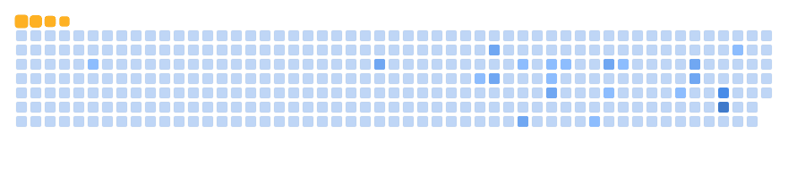

  <h1>
    Hi there 👋 
     
    I'm Qingkaa, a frontend developer  
  </h1>

    
    
    
    
    
    
    
    

    
    
    
    

    
    
    
    
    
    
    
    
    

<!-- 贪吃蛇 - 图片有 actions/Generate Snake 定时生成 -->

